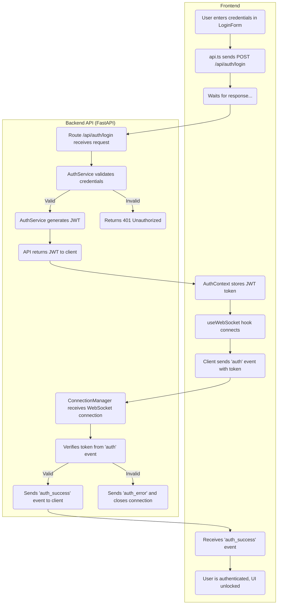
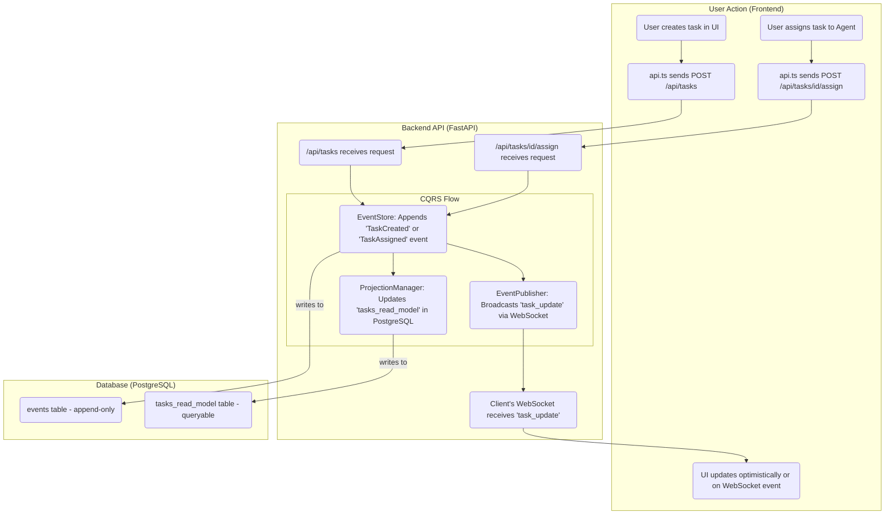
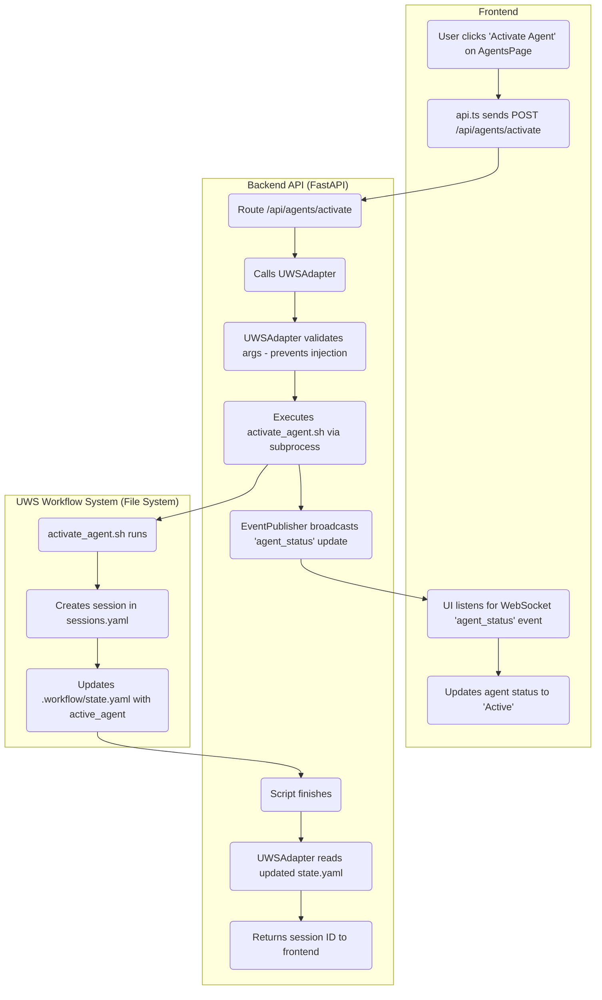
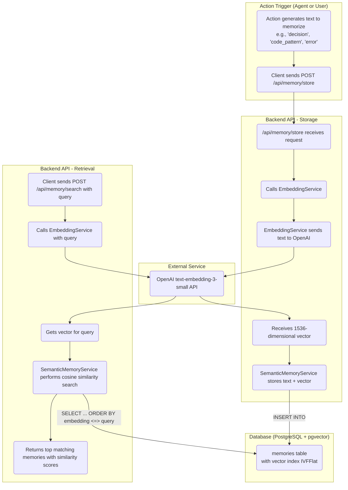
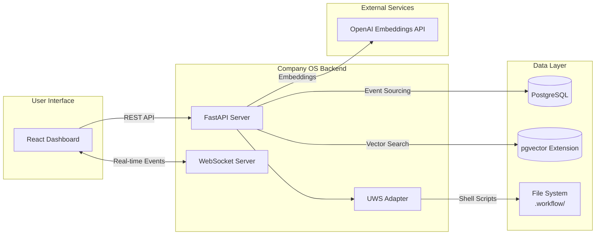
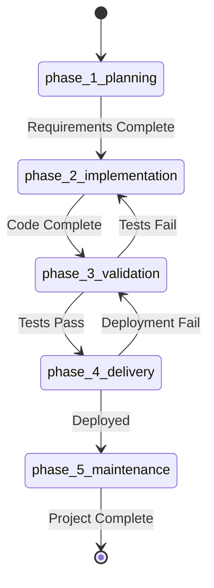
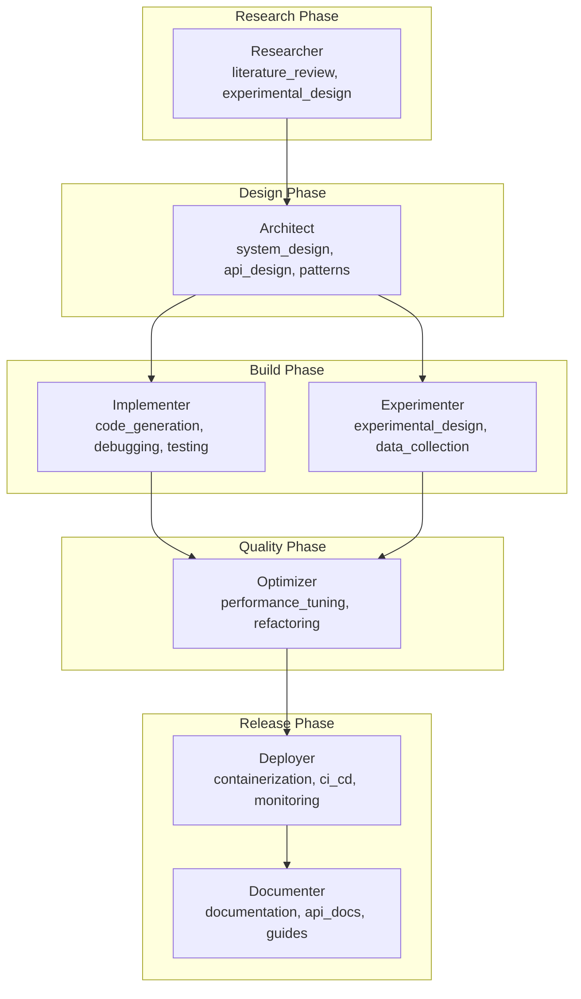

# Company OS Architecture Flowcharts

These diagrams provide a comprehensive view of the Company OS system architecture and operational workflows.
You can render these in any Mermaid-compatible viewer (GitHub, VS Code with Mermaid extension, or [mermaid.live](https://mermaid.live)).

---

## 1. System Hierarchy (Top-Level Architecture)

This diagram shows the layered architecture and data flow between components.

```mermaid
graph TD
    subgraph "Frontend Layer (React + TypeScript + Tailwind)"
        direction LR
        A1[Pages<br/>Dashboard, Tasks, Agents, Memory, Settings]
        A2[Components<br/>LoginForm, Header, Sidebar, AppLayout]
        A3[Hooks<br/>useWebSocket]
        A4[Contexts<br/>AuthContext, WebSocketContext]
        A5[Services<br/>api.ts]
        A1 --> A2 --> A3 & A4 --> A5
    end

    subgraph "API Layer (FastAPI)"
        direction LR
        B1[API Routes<br/>/auth, /tasks, /agents, /memory, /health]
        B2[Core Services<br/>AuthService, EventStore, ProjectionManager, SemanticMemoryService]
        B3[UWSAdapter]
        B1 --> B2
        B1 --> B3
    end

    subgraph "Real-time Layer (WebSocket)"
        C1[ConnectionManager]
        C2[EventPublisher]
        C1 <--> C2
    end

    subgraph "Database Layer (PostgreSQL + pgvector)"
        direction LR
        D1[Event Store<br/>events table]
        D2[Auth Tables<br/>users, organizations, tokens]
        D3[Memory Tables<br/>memories with vector(1536)]
        D4[Read Models<br/>tasks, sessions, approvals]
    end

    subgraph "UWS Workflow System"
        direction LR
        E1[7 Agents<br/>researcher, architect, implementer...]
        E2[Shell Scripts<br/>activate_agent.sh, checkpoint.sh]
        E3[State Files<br/>state.yaml, registry.yaml, handoff.md]
        E1 --> E2 --> E3
    end

    %% Data Flow
    A5 -- "HTTP Requests" --> B1
    B1 -- "Returns JSON" --> A5
    A3 -- "Connects & Listens" --> C1
    C2 -- "Broadcasts Events" --> C1
    C1 -- "Pushes Updates" --> A3
    B2 -- "Reads/Writes" --> D1 & D2 & D3 & D4
    B3 -- "Executes & Reads" --> E2 & E3
```

---

## 2. Authentication Flow

Shows how users authenticate and establish secure WebSocket connections.



---

## 3. Task Creation & Assignment (Event Sourcing / CQRS)

Demonstrates the event sourcing pattern used for task management.



---

## 4. Agent Activation & Session Management

Shows how agents are activated and managed through the UWS integration.



---

## 5. Semantic Memory Storage & Retrieval

Demonstrates the vector-based memory system for AI learning.



---

## 6. Complete Data Flow Summary



---

## 7. UWS Phase Workflow



---

## 8. Agent Hierarchy



---

## How to Render These Diagrams

1. **GitHub**: Copy the Mermaid code blocks into any `.md` file in a GitHub repo - they render automatically
2. **VS Code**: Install the "Mermaid Preview" or "Markdown Preview Mermaid Support" extension
3. **Online**: Paste into [mermaid.live](https://mermaid.live) for interactive editing
4. **Export**: Use mermaid.live to export as PNG, SVG, or PDF

---

*Generated from Company OS architecture analysis - December 2025*
